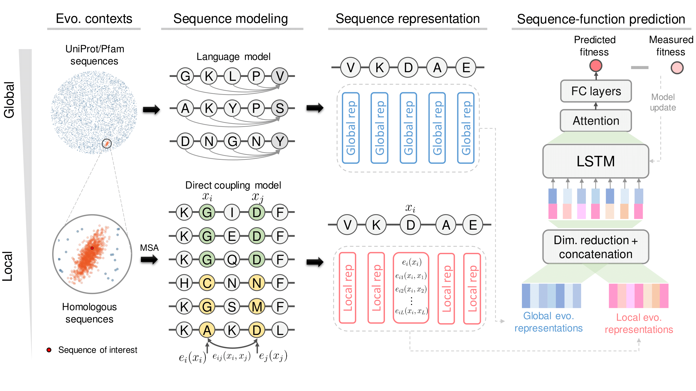

# ECNet
An evolutionary context-integrated deep learning framework for protein engineering

- [ECNet](#ecnet)
  - [Overview](#overview)
  - [Installation](#installation)
  - [Dependencies](#dependencies)
  - [Quick Example](#quick-example)
  - [Running on your own data](#running-on-your-own-data)
  - [Generate local features using HHblits and CCMPred](#generate-local-features-using-hhblits-and-ccmpred)
  - [Citation](#citation)
  - [Contact](#contact)

## Overview
ECNet (evolutionary context-integrated neural network) is a deep learning model that guides protein engineering by predicting protein fitness from the sequence. It integrates local evolutionary context from homologous sequences that explicitly model residue-residue epistasis for the protein of interest with the global evolutionary context that encodes rich semantic and structural features from the enormous protein sequence universe. Please see our [preprint](https://doi.org/10.1101/2020.01.16.908509) for details.

## Installation
Clone and export the GitHub repository directory to python path
```bash
git clone https://github.com/luoyunan/ECNet.git
cd ECNet
export PYTHONPATH=$PWD:$PYTHONPATH
```
## Dependencies
This package is tested under `Python 3.7` and `CUDA 10.1`. Please see `requirements.txt` for necessary python dependencies, all of which can be easily installed with `pip` or `conda`. Due to an issue of installing `pytorch 1.4.0` with `pip`, please install `pytorch` with `conda` first.
```bash
conda install pytorch==1.4.0 cudatoolkit=10.1 -c pytorch
pip install -r requirements.txt
```

## Quick Example
1. Download example data (~95MB) from Google Drive. (modified based on this [solution](https://gist.github.com/iamtekeste/3cdfd0366ebfd2c0d805))
```
wget --load-cookies /tmp/cookies.txt "https://docs.google.com/uc?export=download&confirm=$(wget --quiet --save-cookies /tmp/cookies.txt --keep-session-cookies --no-check-certificate 'https://docs.google.com/uc?export=download&id=1O1qpuaNgY7XFU_LDIq7THc2ESzuPqEsd' -O- | sed -rn 's/.*confirm=([0-9A-Za-z_]+).*/\1\n/p')&id=1O1qpuaNgY7XFU_LDIq7THc2ESzuPqEsd" -O data.tar.gz && rm -rf /tmp/cookies.txt

tar xf data.tar.gz
```
If you run into problems of downloading the example data using the above `wget` command, please manually download [here](https://drive.google.com/file/d/1O1qpuaNgY7XFU_LDIq7THc2ESzuPqEsd/view?usp=sharing).

2. Run the example script. The following script trains an ECNet model using the fitness data of DNA methylase HaeIII ([source](https://journals.plos.org/ploscompbiol/article?id=10.1371/journal.pcbi.1004421)). The scripts randomly splits 70% as training data, 10% as validation data, and 20% as test data.
```bash
CUDA_VISIBLE_DEVICES=0 python scripts/run_example.py \
    --train data/MTH3_HAEAESTABILIZED_Tawfik2015.tsv \
    --fasta data/MTH3_HAEAESTABILIZED_Tawfik2015.fasta \
    --local_feature data/MTH3_HAEAESTABILIZED_Tawfik2015.braw \
    --output_dir ./output \
    --save_prediction \
    --save_checkpoint 
```

## Running on your own data
ECNet has two required input files: 1) a FASTA file of the wild-type sequence, and 2) a TSV file describes the fitness values of variants. Other optional input files include the output of CCMPred for extracting local features and separate test TSV file.

1. **Sequence FASTA file** (`--fasta`, required). A regular FASTA file of the wild-type sequence. This file should contain only one sequence.
2. **Fitness TSV file** (`--train`, required). Each line has two columns `mutation` and `score` separated by tab, describing the fitness value of a variant. The `mutation` column is a string has the format `[ref][pos][alt]`, e.g., `S100T`, meaning that the 100-th amino acid (index starting from 1) mutated from `S` to `T`. If a variant has multiple mutations, `;` is used to concatenated mutations. The `score` column is a numerical value quantifies the variant's fitness. Example:
```
mutation    score
M1S         1.0
F12I;L30K   2.0
G89A        0.06
```
This file is supplied using the `--train` argument. If no separate test data is provided through the `--test` argument, this TSV file will be split into three sets (train, valid, and test) using ratio specified by `--split_ratio` (which are 3 float numbers). If there is another test TSV file is provided, this TSV file will be split into two sets (train and valid) as specified by `--split_ratio` (which are 2 float numbers).
3. **Local features** (`--local_feature`, optional). A binary file generated by CCMPred (using the `-b` option). ECNet will extract local features from this file. This file is optional. If not provided, please add `--no_local_feature` flag when running `run_example.py` (or, equivalently, set `use_local_features=False` for the `ECNet` class) and ECNet won't use the local features. See below for instruction of generating this binary file using HHblits and CCMPred.
4. **Additional test TSV file** (`--test`, optional). This file has the same format as the `--train` TSV file.

We suggest users tune hyperparameters for new protein. Several hyperparameters are exposed as arguments, e.g., `d_embed`, `d_model`, `d_h`, `n_layers`, etc.

## Generate local features using HHblits and CCMPred
1. Install [HHsuite](https://github.com/soedinglab/hh-suite) and [CCMPred](https://github.com/soedinglab/CCMpred) following their instructions. Note that CCMPred should be installed from the latest branch instead of the release.
2. Prepare a FASTA file `example.fasta` of the wild-type sequence of our interested protein.
3. Search the homologous sequences of the wild-type sequence using `hhblits` in HHsuite. (There multiple ways to search homologous sequences and format the alignment. Below we describe a way that uses hhblits to search homologous sequences. Other ways are also feasible, e.g., using jackhmmer as described in the [DeepSequence](https://www.nature.com/articles/s41592-018-0138-4) paper.)
```bash
hhblits -i example.fasta \
    -d ${path_to_hhblits_database} \
    -o example.hhr \
    -oa3m example.a3m \
    -n 3 \
    -id 99 \
    -cov 50 \
    -cpu 8
```
4. Reformat the a3m output of hhblits to PSICOV format (solution modified from [here]([conda install -c anaconda cmake](https://github.com/soedinglab/bbcontacts/blob/master/TUTORIAL.md#step-13-reformat-the-output-alignment))). In order to run CCMpred, the alignment must be reformatted to the "PSICOV" format used by CCMpred. We can first use the `reformat.pl` script from the `hh-suite/scripts` directory to get an alignment in fasta format and then the `convert_alignment.py` from the `CCMpred/scripts` directory to get the PSICOV format:
```bash
${path_to_hh-suite}/scripts/reformat.pl example.a3m example.fas -r
python ${path_to_CCMpred}/scripts/convert_alignment.py example.fas fasta example.psc
```
5. Run CCMPred
```bash 
ccmpred example.psc example.mat -b example.braw -d 0
```
6. Use the argument `--local_feature example.braw` to provide the local features to ECNet.

## Citation
At this moment, please cite the following preprint.

> Luo, Y., Vo, L., Ding, H., Su, Y., Liu, Y., Qian, W. W., Zhao, H., & Peng, J. (2020). Evolutionary context-integrated deep sequence modeling for protein engineering. Cold Spring Harbor Laboratory. https://doi.org/10.1101/2020.01.16.908509

```
@article {Luo2020.01.16.908509,
	author = {Luo, Yunan and Vo, Lam and Ding, Hantian and Su, Yufeng and Liu, Yang and Qian, Wesley Wei and Zhao, Huimin and Peng, Jian},
	title = {Evolutionary context-integrated deep sequence modeling for protein engineering},
	elocation-id = {2020.01.16.908509},
	year = {2020},
	doi = {10.1101/2020.01.16.908509},
	publisher = {Cold Spring Harbor Laboratory},
	URL = {https://www.biorxiv.org/content/early/2020/01/17/2020.01.16.908509},
	eprint = {https://www.biorxiv.org/content/early/2020/01/17/2020.01.16.908509.full.pdf},
	journal = {bioRxiv}
}

```
## Contact
Please submit GitHub issues or contact Yunan Luo (luoyunan[at]gmail[dot]com) for any questions related to the source code.
